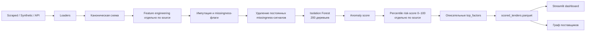

# Tender Scope

Tender Scope — MVP для аналитика антимонопольного органа или службы внутреннего контроля заказчика. Он ранжирует государственные закупки по риску низкой конкуренции, чтобы направлять ручную проверку на наиболее нетипичные случаи, а не делать утверждения о конкретных компаниях.

## Бриф хакатона

1. **Проблема.** Среди тысяч формально конкурентных закупок сложно вручную быстро увидеть одинокие заявки, короткие окна подачи, цены выше привычных и повторяемость победителей.
2. **Почему это не просто автоматизация.** Одна заявка сама по себе может быть нормой для узкой категории. Модель учитывает набор статистических сигналов в контексте заказчика, категории и суммы, а не только одно SQL-правило.
3. **Данные.** Открытый список лотов goszakup.gov.kz, синтетический датасет для разработки и, при появлении токена, CSV/JSON-выгрузка API.
4. **Пользователь.** Аналитик антимонопольного органа или внутреннего контроля закупающей организации.
5. **Измеримый результат.** В synthetic-валидации 79,61% известных скрытых паттернов попадают в верхние 10% риск-рейтинга; в интерфейсе каждая запись имеет описательный разбор отклонений факторов.

## Результат MVP

- 13 321 обработанная закупка: 7 321 реальный scraped-лот и 6 000 synthetic-записей для валидации.
- Воспроизводимый Isolation Forest с 200 деревьями и `random_state=42`.
- Независимый расчёт признаков, модели и percentile risk-score внутри каждого источника.
- Risk-score от 0 до 100, таблица приоритетов, разбор тендера и граф связей поставщиков.
- 21 автоматический тест для загрузчиков, признаков, модели, объяснений и end-to-end pipeline.

Интерактивная техническая презентация: [presentation/tender_scope_technical_solution.html](presentation/tender_scope_technical_solution.html).

## Данные и валидация

| Контур | Строк | Назначение |
|---|---:|---|
| `scraped` | 7 321 | Реальные открытые лоты goszakup.gov.kz для продуктового ранжирования |
| `synthetic` | 6 000 | Данные той же схемы со скрытыми риск-паттернами для количественной проверки |
| **Всего** | **13 321** | Единая каноническая схема, но отдельные модели и ранжирование по `source` |

Для реальных закупок пока нет проверенных меток нарушений, поэтому классическое supervised-разделение на train/test было бы искусственным. Isolation Forest обучается без целевой метки. Поле `is_captured_ground_truth` используется только во внутреннем synthetic-контуре при разовом измерении качества, не входит в признаки и удаляется из финального `scored_tenders.parquet`.

### Метрики synthetic-валидации

В synthetic-наборе 358 из 6 000 записей содержат встроенный риск-паттерн. Метрики рассчитаны относительно этого ground truth после скоринга модели.

| Метрика | Значение | Что показывает |
|---|---:|---|
| ROC-AUC | **0,965** | Качество ранжирования по всему диапазону risk-score |
| Average Precision | **0,580** | Точность ранжирования при базовой доле позитивов 5,97% |
| Recall@top-10% | **79,61%** | В верхних 600 позициях найдено 285 из 358 паттернов |
| Precision@top-10% | **47,50%** | 285 из 600 приоритетных записей содержат паттерн |

Для сравнения, наивное правило `single_bidder_flag == True ИЛИ competitive_method_flag == False` отмечает 2 547 synthetic-записей — 42,45% всего набора. Оно получает recall 100%, но precision только 14,06%. Isolation Forest находит 79,61% паттернов при проверке лишь 10% записей и повышает precision до 47,50%. Практический выигрыш ML — не в создании ещё одного флага, а в ранжировании большой очереди по сочетанию сигналов.

Эти цифры доказывают работоспособность механизма на synthetic-контуре, но не являются заявлением о точности обнаружения реальных нарушений в scraped-данных. Для такой оценки нужны результаты проверок аналитиков.

## Архитектура Isolation Forest pipeline



### Модельные признаки

| Признак | Смысл |
|---|---|
| `single_bidder_flag` | В закупке один участник |
| `price_zscore` | Цена находится в верхнем хвосте сопоставимой группы |
| `window_ratio` | Окно подачи относительно медианы категории |
| `customer_category_hhi` | Концентрация победителей у заказчика внутри категории |
| `competitive_method_flag` | Известный конкурентный или неконкурентный способ закупки |

Неизвестные значения не превращаются в риск автоматически: они сохраняются как `NaN`, получают `*_missing` и импутируются перед моделью. Missingness-флаги, постоянные для целого источника, удаляются из матрицы этого источника, чтобы модель не принимала происхождение данных за риск.

Isolation Forest строит случайные разбиения пространства признаков. Нетипичные комбинации изолируются за меньшее число разбиений и получают более высокий anomaly score. Алгоритм выбран потому, что реальные размеченные нарушения пока отсутствуют, а риск зависит от комбинации нескольких сигналов, а не от одного правила.

После модели `raw_score` преобразуется в percentile risk-score от 0 до 100 отдельно внутри `scraped`, `synthetic` и `api`. Поэтому источник с системно более полными или более разреженными данными не вытесняет остальные источники из верхней части рейтинга.

## Быстрый запуск

Требуется Python 3.11+.

```bash
python -m pip install -r requirements.txt
python -m src.pipeline --source synthetic
streamlit run app/dashboard.py
```

Пайплайн автоматически создаёт `data/raw/synthetic_goszakup.csv`, если файла ещё нет, и сохраняет результат в `data/processed/scored_tenders.parquet`.

При развёртывании на Streamlit Community Cloud дашборд выполняет этот synthetic-пайплайн автоматически при первом запуске, если сгенерированные CSV/parquet отсутствуют в репозитории.

Запуск тестов:

```bash
python -m pytest -v
```

## Источники

```bash
# public-lot CSV, созданный supplied scraper
python scrape_goszakup_lots.py --pages 20 --out data/raw/goszakup_lots.csv
python -m src.pipeline --source scraped

# объединить доступные данные
python -m src.pipeline --source all

# API CSV или JSON, когда появится токен/выгрузка
python -m src.pipeline --source api --api-path data/raw/api_export.json
```

Для API поддерживаются обычные поля `tender_id`, `customer`, `category`, `trade_method`, даты, сумма, число участников и победитель, а также распространённые варианты их названий. Отсутствующий API-файл не блокирует `--source all`.

## Ограничения и интерпретация

Публичная страница списка лотов не содержит количества участников, дат публикации/окончания и победителей. Загрузчик не выдумывает эти данные: для способов с формулировкой «из одного источника» число участников фиксируется как один, остальные недоступные значения сохраняются как пропуски с флагами missing.

Признак концентрации победителей (HHI) рассчитывается только для synthetic и api источников — scraped-реестр лотов не содержит данных о победителе, поэтому для него HHI всегда отсутствует (100% missing).

Категория scraped-лота определяется детерминированной эвристикой по русским ключевым словам в названии: продукты, дорожные и проектные работы, метрология, обучение, полиграфия, инженерное обслуживание, электрика, ГСМ, медицина, IT и другие распространённые группы. Нераспознанные названия становятся `Прочее`; это не классификатор ОКЭД и должно учитываться при интерпретации.

Ценовой сигнал считает только завышенные цены из верхних 10% сопоставимой группы в логарифмической шкале и ограничивается перед подачей в модель, поэтому крупные инфраструктурные проекты не подавляют обычные закупки. В объяснении цена показывается перцентилем внутри сопоставимой группы, а не процентом к потенциально малой медиане.

Risk-score показывает статистическую нетипичность, а не доказательство сговора, коррупции или нарушения. Граф поставщиков — только материал для последующего изучения аналитиком и не участвует в модели.

Признаки и risk-score рассчитываются отдельно внутри каждого источника: scraped сравнивается со scraped, synthetic — с synthetic. Missingness-признаки, постоянные внутри конкретного источника, перед обучением исключаются как сигналы происхождения данных. Незнакомый или отсутствующий способ закупки остаётся неизвестным значением и не маркируется как неконкурентный.

`top_factors` — описательный разбор отклонений входных признаков относительно группы сравнения. Это не строгая атрибуция решения Isolation Forest: модель напрямую не участвует в вычислении текстов факторов.
